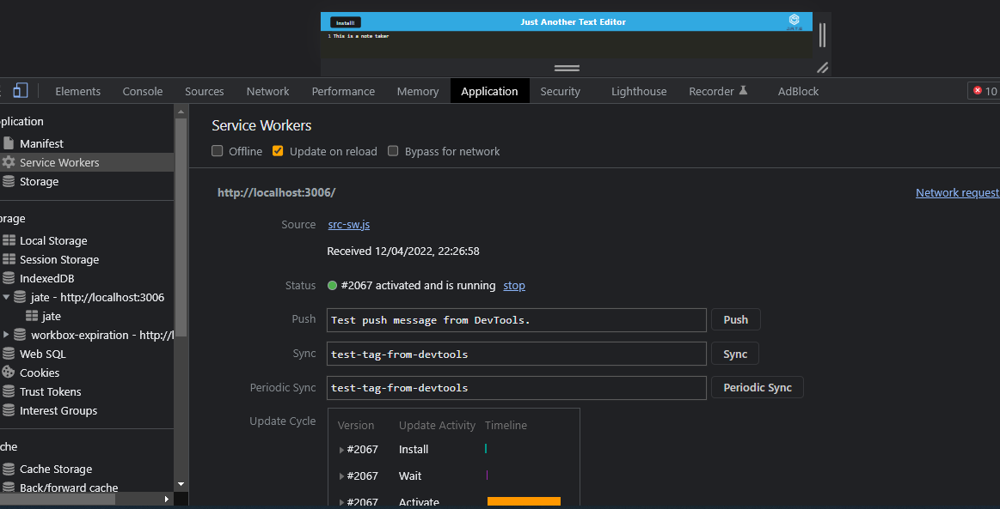
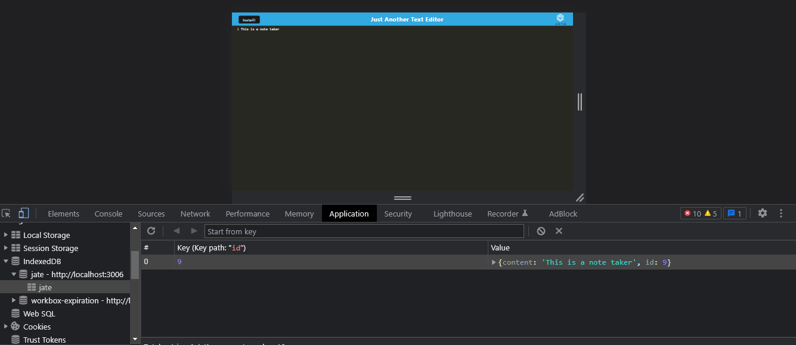

# PWA_Text_Editor
## Table of contents
* [General info](#general-info)
* [Technologies](#technologies)
* [Working Application](#working-application)
* [Project Status](#project-status)
* [Installation](#installation)
* [License](#license)
* [Contact Me](#contact-me)

## General info

The application is a simple text editor that thanks to the use of service workers, can works both online and offline. The app can also be installed and uses a IndexedDB database to store data. 

## Technologies

Project is created with the use of:
* Node.js
* Express.js
* Service workers
* Manifest
* IndexedDB

## Working Application

The following image shows the web application's serwice worker 

The app's manifest 
IndexedDB 

## Project Status

* Working

## Installation

To run locally the application clone [this link](https://github.com/Nico749/PWA_Text_Editor.git) on your local machine or check the [heroku](https://my-jate-text-editor.herokuapp.com/) version

## License

Distributed under MIT License.

## Contact me 

Created by [Nico Pasqualini](https://github.com/Nico749) - feel free to contact me!